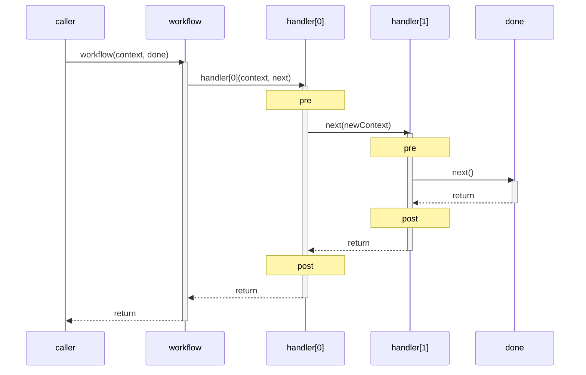

# @produck/compose

Compose a list of handlers (functions) into a single middleware handler,
inspired by [koa-compose](https://github.com/koajs/compose).

## Overview

`@produck/compose` is a **fixed-protocol handler composer**. It assembles
multiple handler functions into a single callable workflow, where each handler
follows an invariant signature: `(context, next) => R`.

Unlike general-purpose pipeline or stream libraries, the protocol is not
configurable — every handler receives exactly two arguments (a shared context
and a control function), and the control flow follows a strict sequential
model. This fixed protocol is the core constraint that makes the library
predictable and composable.

## Installation

```sh
npm install @produck/compose
```

## Usage

Start with the quick middleware chain in
[Quick start](#ex-quick-start).

## Protocol

The compose protocol is defined by two contracts:

- **Handler** — `(context: T, next: Next) => R`
- **Next** — `(context?: T) => unknown`

Each handler receives the current `context` and a `next` function to pass
control downstream. Handlers execute in registration order on the way "down"
and in reverse order on the way "back up" (the onion / Koa model).

### Execution flow



### Rules

1. A handler **may** call `next()` zero or one time. Calling it more than once
   throws an error. See [single-call rule](#ex-single-call-rule).
2. Code before `next()` runs in registration order (downstream).
3. Code after `next()` runs in reverse registration order (upstream).
4. `context` is the same object for all handlers — mutations are visible to
   every handler in the chain. See
   [shared context adaptation](#ex-context-adaptation).

### The nature of `next`

`next` is a **bare continuation** — its guaranteed behavior is to invoke the
next handler in the chain and return its value. Compose itself does not define
what `next()` should return, whether it should be awaited, or what to do with
its result. See [next return semantics](#ex-next-semantics).

When called with a `newContext` argument, that value replaces the current
context for all downstream handlers — see
[context replacement](#ex-context-replacement). Each handler decides for
itself what `next()` means — whether to await it, assert its return value,
catch its rejection, or skip calling it altogether. Compose does not impose a
global contract on `next`'s return semantics. This is not a limitation; it is
a deliberate property of the design: **the meaning of `next` is defined
locally, by the handler that calls it, not globally by the composer.**

## Protocol adaptation via context

Because `context` is an opaque object shared by reference, the fixed
`(context, next)` signature can express a wide range of middleware protocols
by wrapping multi-argument signatures into a single context object:

| Original protocol       | Adapted as context shape  |
| ----------------------- | ------------------------- |
| `(req, res, next)`      | `ctx = { req, res }`      |
| `(value, next)`         | `ctx = { value }`         |
| `(err, data, next)`     | `ctx = { err, data }`     |
| `(message, meta, next)` | `ctx = { message, meta }` |

The only truly fixed element is `next` itself — a continuation function that
may optionally receive a new context to replace the current one for downstream
handlers. Everything else lives in context and is entirely caller-defined.

See [context adaptation example](#ex-context-adaptation).

In practice, most "protocol differences" across middleware systems are just
differences in how arguments are organized — they collapse naturally into a
shared context object. This is why a fixed-protocol composer like
`@produck/compose` can cover far more scenarios than its simple signature
might suggest.

## API

### `compose(...handlers)`

Composes zero or more handler functions into a single middleware function.

- `handlers` — zero or more functions matching the `Handler` signature.
- **Returns**: `(context, done?) => any`
  - `context` — any value passed through the chain.
  - `done` — optional final callback invoked only when the chain reaches the
    terminal link via `next()` (default: no-op).

### `Handler<T, R>`

```ts
type Handler<T, R> = (context: T, next: Next) => R;
```

### `Next`

```ts
type Next<T = unknown> = (context?: T) => unknown;
```

When called without arguments, the current context is passed through to the
next handler. When called with a value, that value becomes the context for all
downstream handlers — see
[context replacement example](#ex-context-replacement).

> The library does not restrict the type of the replacement value — it is
> possible to pass a completely different context shape to downstream handlers.
> This is uncommon in practice but remains a valid use of the protocol.

## Application scenarios

Use the table below to jump from scenario to the closest runnable example.

| Scenario                             | Typical fit                                             | Example                                                     |
| ------------------------------------ | ------------------------------------------------------- | ----------------------------------------------------------- |
| HTTP middleware pipelines            | Logging, auth, parsing, routing in onion order          | [Quick start](#ex-quick-start)                              |
| Lifecycle hooks                      | Ordered phases like connect -> migrate -> seed -> ready | [With a done callback](#ex-lifecycle-hooks)                 |
| Plugin / extension chains            | Wrap core behavior with metrics, cache, validation      | [Branching / forking](#ex-plugin-chain)                     |
| Context isolation                    | Derive new context per scope without mutating parent    | [Context replacement](#ex-context-replacement)              |
| Data transformation pipelines        | Mutate shared context across sequential steps           | [Nested composition](#ex-data-transform)                    |
| Conditional routing                  | Select different downstream paths by runtime state      | [Conditional downstream dispatch](#ex-conditional-dispatch) |
| Nested composition (context slicing) | Split large flows into focused sub-workflows            | [Nested composition](#ex-nested-composition)                |

## Usage limitations

### Fixed protocol is not general-purpose

The `(context, next)` signature is designed for the onion model. If you need
arbitrary argument shapes, named hooks, event emitters, or configurable
middleware signatures, `@produck/compose` is not the right tool.

### Single-call constraint per handler

Each handler may invoke `next()` only once. This prevents ambiguous control
flow, but precludes patterns like fan-out or multicast without explicit
wrapper handlers. See [single-call rule](#ex-single-call-rule).

### No automatic error propagation

Errors thrown in a handler must be caught by an outer handler wrapping
`next()`. There is no built-in error middleware — error handling is explicit.
See [error boundary example](#ex-error-boundary).

### Synchronous by default

All handlers execute synchronously unless they return a Promise (or use
`async`). If one handler is async, all upstream handlers must `await next()`
to preserve ordering. See [next return semantics](#ex-next-semantics).

### Shared mutable context

`context` is passed by reference to every handler. Accidental mutation in one
handler can affect downstream or upstream handlers. Use
[context replacement](#ex-context-replacement) to pass a derived or
immutable object without mutating the original, or adopt defensive copying /
immutable patterns for complex workflows. See
[nested composition](#ex-nested-composition).

## Examples

Example index:

- [Quick start](#ex-quick-start)
- [With a done callback](#ex-done-callback)
- [Lifecycle hooks (same example)](#ex-lifecycle-hooks)
- [Single-call rule](#ex-single-call-rule)
- [`next()` return semantics](#ex-next-semantics)
- [Context adaptation](#ex-context-adaptation)
- [Context replacement](#ex-context-replacement)
- [Branching / forking](#ex-branching)
- [Plugin / extension chains (same example)](#ex-plugin-chain)
- [Conditional downstream dispatch](#ex-conditional-dispatch)
- [Nested composition (context slicing)](#ex-nested-composition)
- [Data transformation pipeline (same example)](#ex-data-transform)
- [Error boundary](#ex-error-boundary)
- [TypeScript](#ex-typescript)

<a id="ex-quick-start"></a>

### Quick start

```js
import { compose } from '@produck/compose';

const middleware = compose(
  (ctx, next) => {
    console.log('-> first');
    next();
    console.log('<- first');
  },
  (ctx, next) => {
    console.log('-> second');
    next();
    console.log('<- second');
  },
);

middleware({});
// -> first
// -> second
// <- second
// <- first
```

<a id="ex-done-callback"></a>
<a id="ex-lifecycle-hooks"></a>

### With a done callback

```js
compose(
  (_, next) => next(),
  (_, next) => next(),
)({}, () => console.log('done'));
```

<a id="ex-single-call-rule"></a>

### Single-call rule

```js
const middleware = compose((_, next) => {
  next();
  next(); // throws: next() called multiple times
});

middleware({});
```

<a id="ex-next-semantics"></a>

### `next()` return semantics

```js
// Handler A validates next's return
const a = async (ctx, next) => {
  const result = await next();
  console.assert(result === 'ok');
};

// Handler B ignores next's return entirely
const b = (ctx, next) => {
  next();
  return 'early';
};

// Handler C wraps next in error handling
const c = async (ctx, next) => {
  try {
    return await next();
  } catch (err) {
    return 'fallback';
  }
};
```

<a id="ex-context-adaptation"></a>

### Context adaptation

```js
// Express-style middleware adapted via context
compose((ctx, next) => {
  console.log(ctx.req.url);
  next();
})({ req, res });
```

<a id="ex-context-replacement"></a>

### Context replacement

Pass a new context to `next()` to replace the current context for downstream
handlers, without mutating the original object.

```js
const workflow = compose(
  (ctx, next) => {
    // Derive a new context instead of mutating the original
    next({ ...ctx, phase: 'processing' });
  },
  (ctx, next) => {
    console.log(ctx.phase); // 'processing'
    next();
  },
);

workflow({ phase: 'init' });
```

<a id="ex-branching"></a>
<a id="ex-plugin-chain"></a>

### Branching / forking

```js
const workflowA = compose(fnA);
const workflowB = compose(fnB);

const workflow = compose((ctx, next) => {
  return ctx.flag ? workflowA(ctx, next) : workflowB(ctx, next);
});
```

<a id="ex-conditional-dispatch"></a>

### Conditional downstream dispatch

Use nested composition when you need to route to different "next-level"
handlers by condition.

```js
const paidPath = compose(
  (ctx, next) => {
    ctx.steps.push('validate-payment');
    next();
  },
  (ctx, next) => {
    ctx.steps.push('charge-card');
    next();
  },
);

const freePath = compose((ctx, next) => {
  ctx.steps.push('skip-payment');
  next();
});

const checkout = compose(
  (ctx, next) => {
    return ctx.total > 0 ? paidPath(ctx, next) : freePath(ctx, next);
  },
  (ctx, next) => {
    ctx.steps.push('finalize-order');
    next();
  },
);

const ctx = { total: 100, steps: [] };
checkout(ctx);
// ctx.steps = ['validate-payment', 'charge-card', 'finalize-order']
```

<a id="ex-nested-composition"></a>
<a id="ex-data-transform"></a>

### Nested composition (context slicing)

```js
// Pricing sub-workflow — only cares about pricing data
const calcPrice = compose(
  (ctx, next) => {
    ctx.subtotal = ctx.quantity * ctx.unitPrice;
    next();
  },
  (ctx, next) => {
    ctx.tax = ctx.subtotal * 0.1;
    next();
  },
  (ctx, next) => {
    ctx.total = ctx.subtotal + ctx.tax;
    next();
  },
);

// Validation sub-workflow — only cares about order integrity
const validate = compose(
  (ctx, next) => {
    if (!ctx.items?.length) {
      throw Error('empty order');
    }

    next();
  },
  (ctx, next) => {
    ctx.items.forEach((v) => (v.checked = true));
    next();
  },
);

// Notification sub-workflow — only cares about delivery
const notify = compose(
  (ctx, next) => {
    ctx.log.push('email queued');
    next();
  },
  (ctx, next) => {
    ctx.log.push('sms queued');
    next();
  },
);

// Top-level: each sub-composition receives its own context slice
const placeOrder = compose(
  (ctx, next) => validate({ items: ctx.orderItems }, next),
  (ctx, next) => calcPrice(ctx.priceCtx, next),
  (ctx, next) => notify(ctx.notifyCtx, next),
);

placeOrder({
  orderItems: [{ sku: 'A', qty: 2 }],
  priceCtx: { quantity: 2, unitPrice: 100 },
  notifyCtx: { log: [] },
});
// -> notifyCtx.log === ['email queued', 'sms queued']
// -> priceCtx.total === 220
```

<a id="ex-error-boundary"></a>

### Error boundary

```js
compose(
  async (_, next) => {
    try {
      await next();
    } catch (err) {
      console.error('caught:', err);
    }
  },
  async () => {
    throw new Error('boom');
  },
);
```

<a id="ex-typescript"></a>

### TypeScript

```ts
import type { Handler } from '@produck/compose';

const handler: Handler<{ user: string }, Promise<void>> = async (ctx, next) => {
  console.log(ctx.user);
  await next();
};
```

## License

MIT
