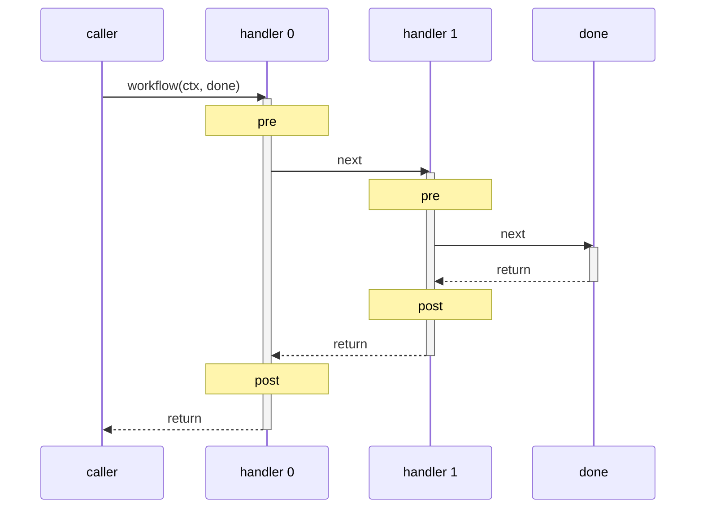

# @produck/compose

Compose a list of handlers (functions) into a single middleware handler,
inspired by [koa-compose](https://github.com/koajs/compose).

## Overview

`@produck/compose` is a **fixed-protocol handler composer**. It assembles
multiple handler functions into a single callable workflow, where each handler
follows an invariant signature: `(context, next) => void`.

Unlike general-purpose pipeline or stream libraries, the protocol is not
configurable — every handler receives exactly two arguments (a shared context
and a control function), and the control flow follows a strict sequential
model. This fixed protocol is the core constraint that makes the library
predictable and composable.

## Installation

```sh
npm install @produck/compose
```

## Usage

```js
import { compose } from '@produck/compose';

const middleware = compose(
  (ctx, next) => {
    console.log('→ first');
    next();
    console.log('← first');
  },
  (ctx, next) => {
    console.log('→ second');
    next();
    console.log('← second');
  },
);

middleware({});
// → first
// → second
// ← second
// ← first
```

## Protocol

The compose protocol is defined by two contracts:

- **Handler** — `(context: T, next: Next) => R`
- **Next** — `() => unknown`

Each handler receives the shared `context` and a `next` function to pass
control downstream. Handlers execute in registration order on the way "down"
and in reverse order on the way "back up" (the onion / Koa model).

### Execution flow



### Rules

1. A handler **may** call `next()` zero or one time. Calling it more than once
   throws an error.
2. Code before `next()` runs in registration order (downstream).
3. Code after `next()` runs in reverse registration order (upstream).
4. `context` is the same object for all handlers — mutations are visible to
   every handler in the chain.

### The nature of `next`

`next` is a **bare continuation** — its only guaranteed behavior is to invoke
the next handler in the chain and return its value. Compose itself does not
define what `next()` should return, whether it should be awaited, or what to
do with its result:

```js
// Handler A validates next's return
const a = async (ctx, next) => {
  const result = await next();
  console.assert(result === 'ok');
};

// Handler B ignores next's return entirely
const b = (ctx, next) => {
  next();
  return 'early';
};

// Handler C wraps next in error handling
const c = async (ctx, next) => {
  try {
    return await next();
  } catch (err) {
    return 'fallback';
  }
};
```

Each handler decides for itself what `next()` means — whether to await it,
assert its return value, catch its rejection, or skip calling it altogether.
Compose does not impose a global contract on `next`'s return semantics. This
is not a limitation; it is a deliberate property of the design: **the meaning
of `next` is defined locally, by the handler that calls it, not globally by
the composer.**

## Protocol adaptation via context

Because `context` is an opaque object shared by reference, the fixed
`(context, next)` signature can express a wide range of middleware protocols
by wrapping multi-argument signatures into a single context object:

| Original protocol | Adapted as context shape |
|---|---|
| `(req, res, next)` | `ctx = { req, res }` |
| `(value, next)` | `ctx = { value }` |
| `(err, data, next)` | `ctx = { err, data }` |
| `(message, meta, next)` | `ctx = { message, meta }` |

The only truly fixed element is `next` itself — a zero-argument continuation
function. Everything else lives in context and is entirely caller-defined.

```js
// Express-style middleware adapted via context
compose(
  (ctx, next) => {
    console.log(ctx.req.url);
    next();
  },
)({ req, res });
```

In practice, most "protocol differences" across middleware systems are just
differences in how arguments are organized — they collapse naturally into a
shared context object. This is why a fixed-protocol composer like
`@produck/compose` can cover far more scenarios than its simple signature
might suggest.

## API

### `compose(...handlers)`

Composes zero or more handler functions into a single middleware function.

- `handlers` — zero or more functions matching the `Handler` signature.
- **Returns**: `(context, done?) => any`
  - `context` — any value passed through the chain.
  - `done` — optional final callback invoked after all handlers complete
    (default: no-op).

### `Handler<T, R>`

```ts
type Handler<T, R> = (context: T, next: Next) => R;
```

### `Next`

```ts
type Next = () => unknown;
```

## Application scenarios

### HTTP middleware pipelines

Each handler represents a middleware layer (logging, auth, parsing, routing).
This is the original Koa use case: a request passes through each layer in
order, and responses bubble back up.

```js
const stack = compose(
  addLogger,
  parseBody,
  authenticate,
  handleRoute,
);
```

### Lifecycle hooks

Orchestrate ordered lifecycle stages — for example database connection →
migration → seed → ready, with each stage able to abort or augment the chain.

### Plugin / extension chains

Let plugins register handlers that execute around a core operation, enabling
cross-cutting concerns like metrics, caching, or validation without modifying
the core logic.

### Data transformation pipelines

Chain transformations where each step reads from and writes to a shared
context, and steps can optionally short-circuit by not calling `next()`.

## Usage limitations

### Fixed protocol is not general-purpose

The `(context, next)` signature is designed for the onion model. If you need
arbitrary argument shapes, named hooks, event emitters, or configurable
middleware signatures, `@produck/compose` is not the right tool.

### Single-call constraint per handler

Each handler may invoke `next()` only once. This prevents ambiguous control
flow, but precludes patterns like fan-out or multicast without explicit
wrapper handlers.

### No automatic error propagation

Errors thrown in a handler must be caught by an outer handler wrapping
`next()`. There is no built-in error middleware — error handling is explicit.

```js
compose(async (_, next) => {
  try {
    await next();
  } catch (err) {
    console.error('caught:', err);
  }
}, async () => {
  throw new Error('boom');
});
```

### Synchronous by default

All handlers execute synchronously unless they return a Promise (or use
`async`). If one handler is async, all upstream handlers must `await next()`
to preserve ordering.

### Shared mutable context

`context` is passed by reference to every handler. Accidental mutation in one
handler can affect downstream or upstream handlers. Defensive copying or
immutable patterns are recommended for complex workflows.

## Examples

### With a done callback

```js
compose(
  (_, next) => next(),
  (_, next) => next(),
)({}, () => console.log('done'));
```

### Branching / forking

```js
const workflowA = compose(fnA);
const workflowB = compose(fnB);

const workflow = compose((ctx, next) => {
  return ctx.flag ? workflowA(ctx, next) : workflowB(ctx, next);
});
```

### TypeScript

```ts
import type { Handler } from '@produck/compose';

const handler: Handler<{ user: string }, Promise<void>> = async (ctx, next) => {
  console.log(ctx.user);
  await next();
};
```

## License

MIT
